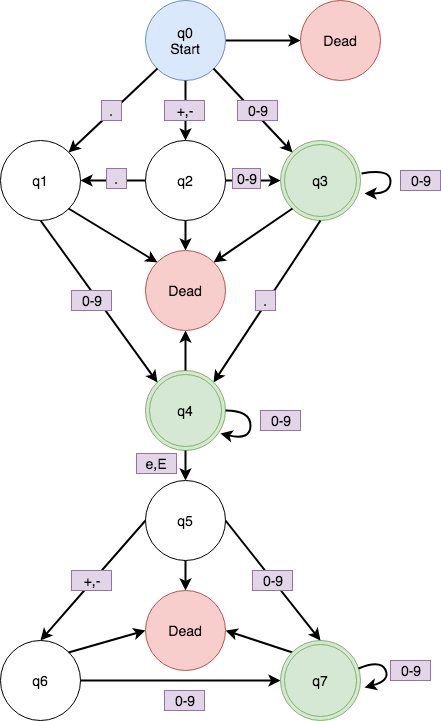

# CS311-DFA-Machine
This program simulates a DFA machine that recognizes a floating point number.

## The language accepted by the machine is:

## The alphabet accepted by the machine is:

## State Diagram

## State Diagram (Minimal)

## Transition Table
DFA | 0-9  | +    | -    | .    | e    | E
--- | ---- | ---- | ---- | ---- | ---- | ----
q0  | q3   | q2   | q1   | q4   | Dead | Dead
q1  | q3   | Dead | Dead | q5   | Dead | Dead
q2  | q3   | Dead | Dead | q5   | Dead | Dead
q3  | q3   | Dead | Dead | q4   | Dead | Dead
q4  | q6   | Dead | Dead | Dead | q7   | q8
q5  | q6   | Dead | Dead | Dead | Dead | Dead
q6  | q6   | Dead | Dead | Dead | q7   | q8
q7  | q9   | q10  | q11  | Dead | Dead | Dead
q8  | q9   | q10  | q11  | Dead | Dead | Dead
q9  | q9   | Dead | Dead | Dead | Dead | Dead
q10 | q9   | Dead | Dead | Dead | Dead | Dead
q11 | q9   | Dead | Dead | Dead | Dead | Dead
Dead| Dead | Dead | Dead | Dead | Dead | Dead

## Transition Table (Minimal)
DFA | 0-9  | +    | -    | .    | e    | E
--- | ---- | ---- | ---- | ---- | ---- | ----
q0  | q3   | q2   | q2   | q1   | Dead | Dead
q1  | q4   | Dead | Dead | Dead | Dead | Dead
q2  | q3   | Dead | Dead | q1   | Dead | Dead
q3  | q3   | Dead | Dead | q4   | Dead | Dead
q4  | q4   | Dead | Dead | Dead | q5   | q5
q5  | q7   | q6   | q6   | Dead | Dead | Dead
q6  | q7   | Dead | Dead | Dead | Dead | Dead
q7  | q7   | Dead | Dead | Dead | Dead | Dead
Dead| Dead | Dead | Dead | Dead | Dead | Dead

## Examples of Accepted Strings
0.5

.5

.5e+4

.5e4

.5E4

.5E-4

+.5E-4

-.5E-4

-2.E-4

23\.

23.e2

232663

23.3523e21

## Examples of Rejected Strings
-.E-4

-2.f-4

-2-4

2.3-e4

++3

+-3

23.e+

3.e+-2

\+ -3

23.e

## Compile first.
Pretty common sense, but just in case... run the following command in terminal:

`g++ -Wall main.cpp -o main`

## How to run the program.
There are two ways to run the program.

`./main`

This will prompt you for a filename and then check all the strings in that file to see if they're valid floating point numbers.

`./main filename.txt`

This is a shortcut and will bypass the prompt.
